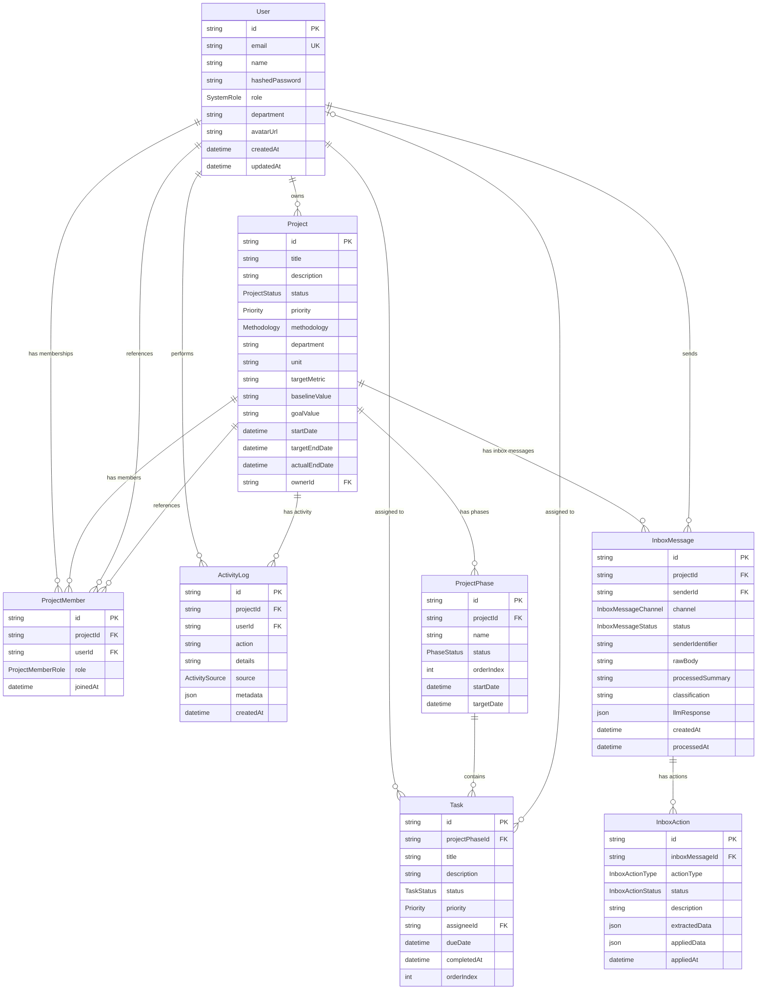
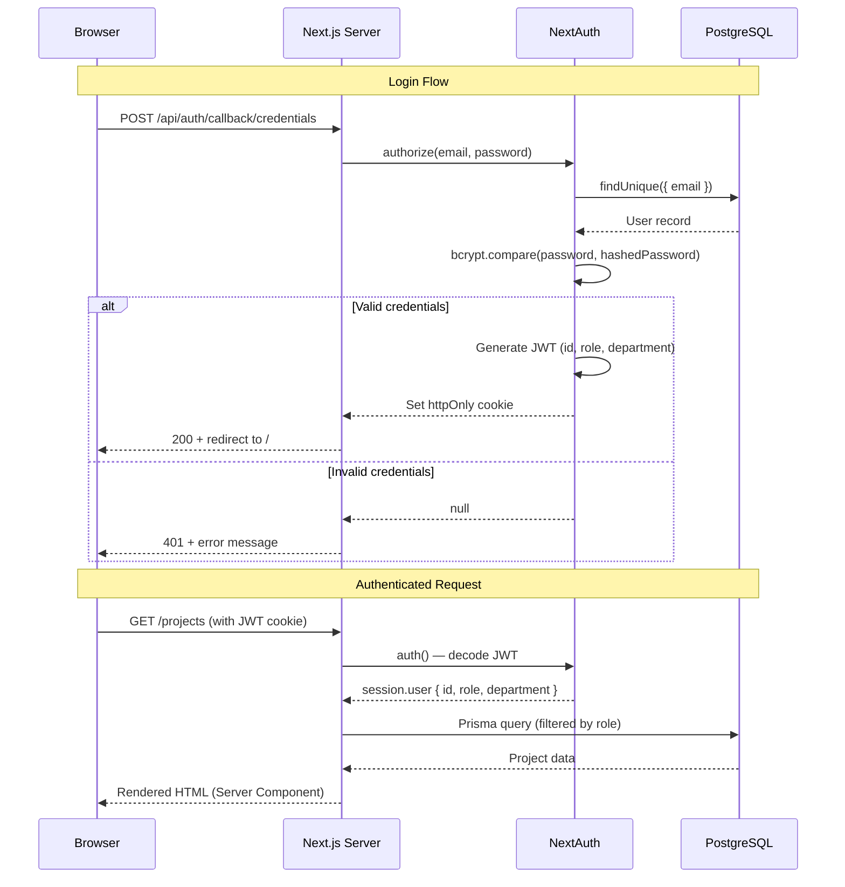
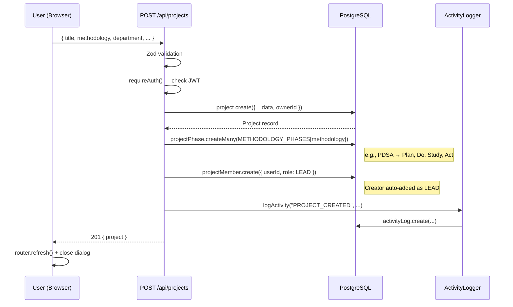
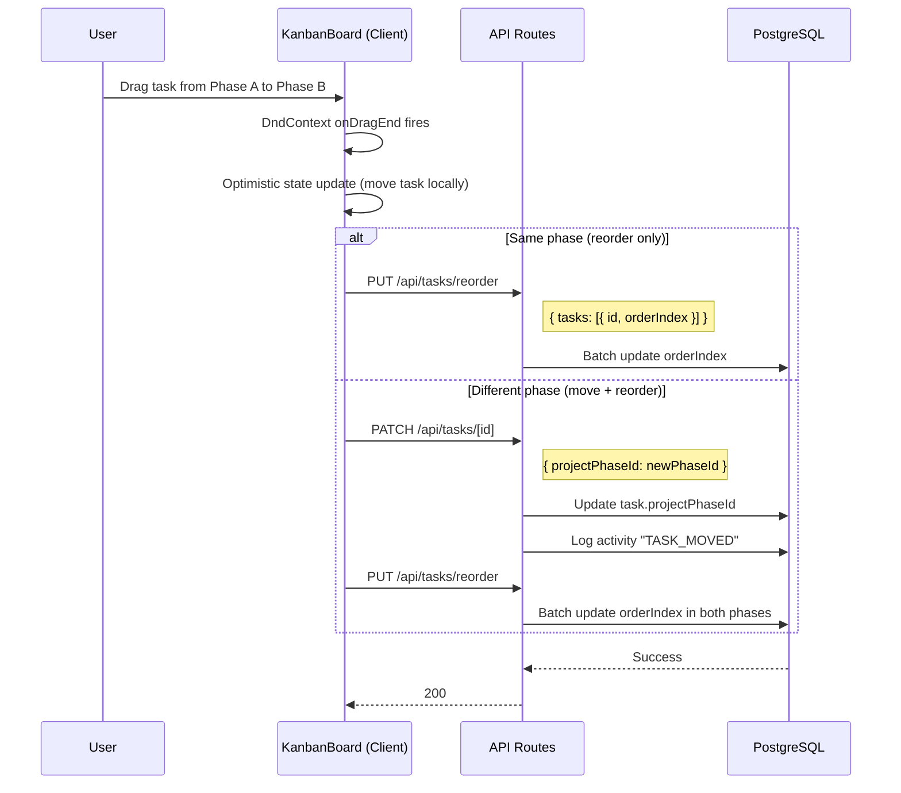
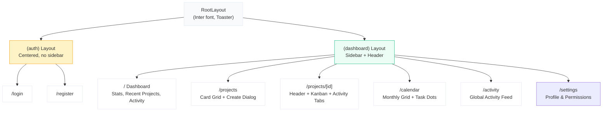
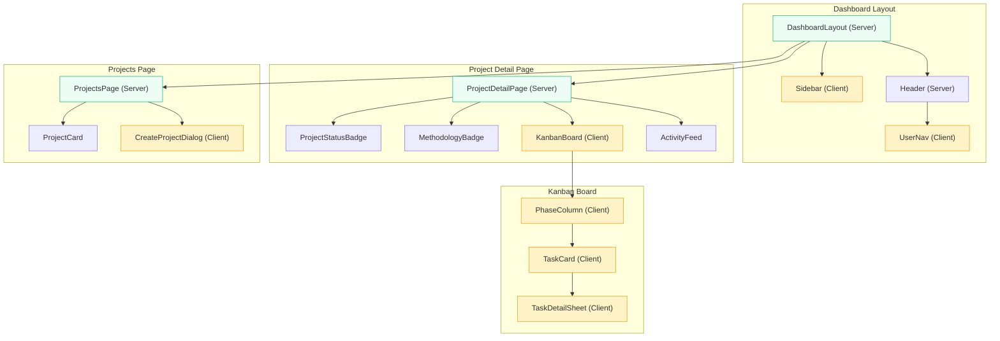
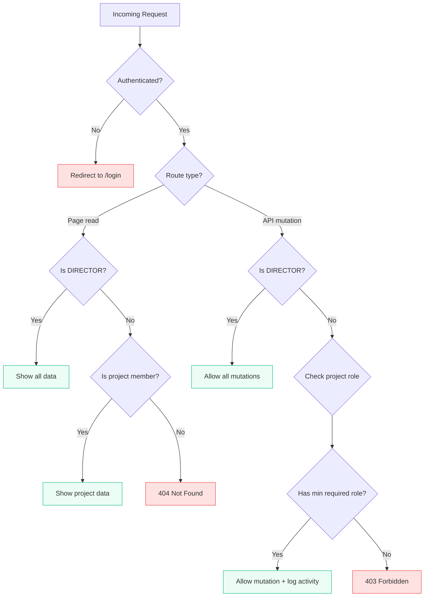
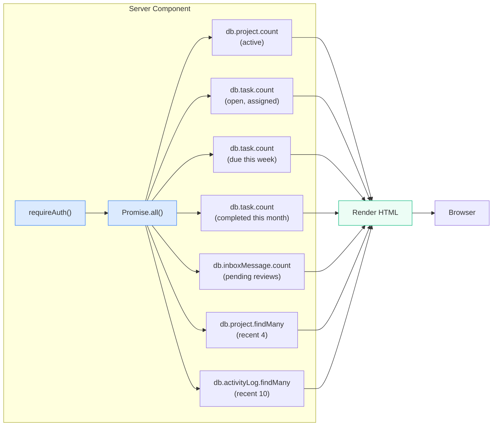
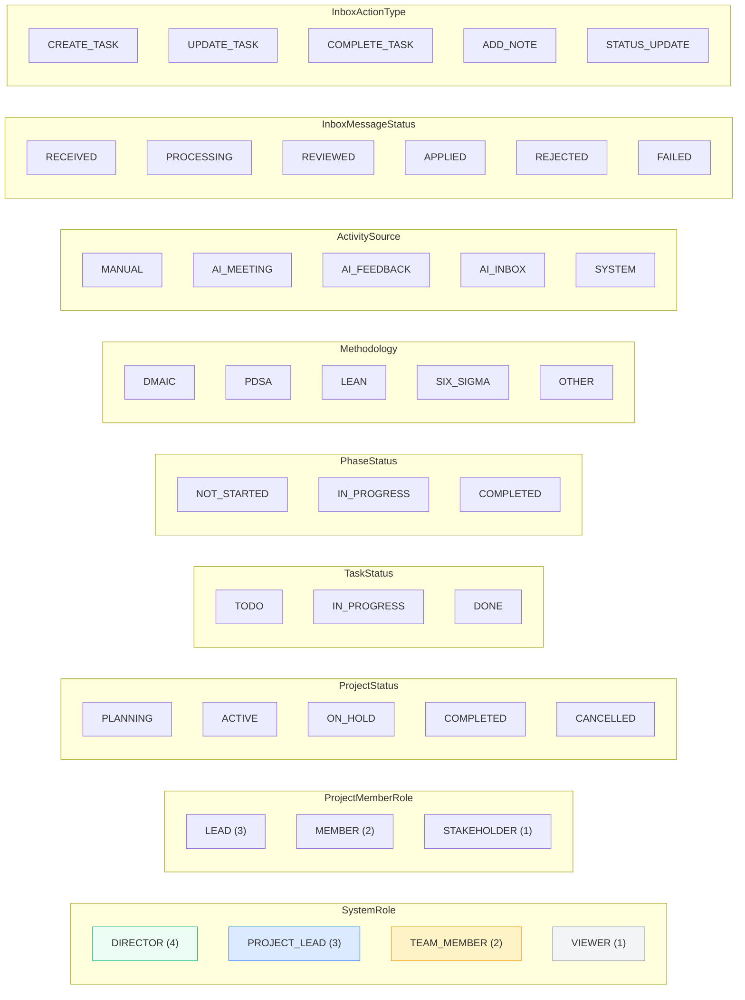
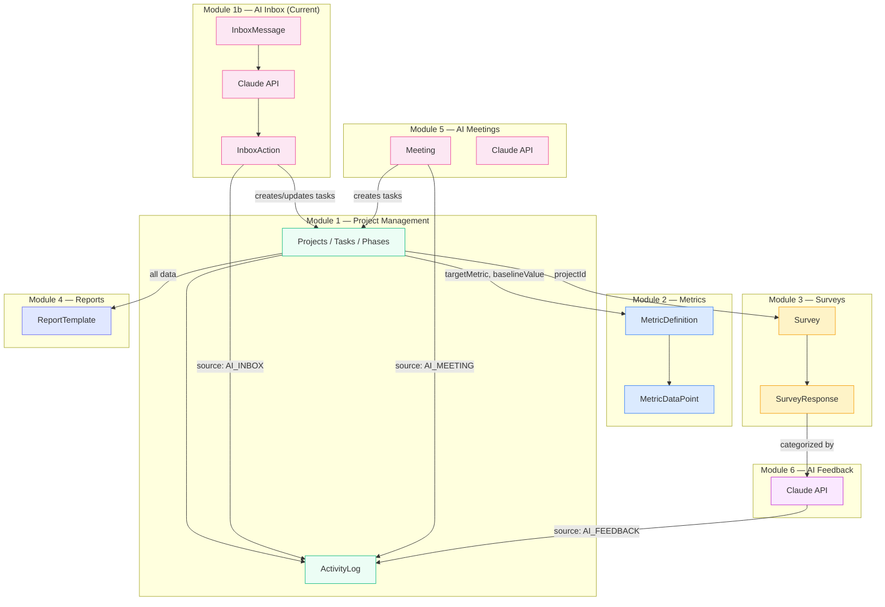

# Diagrams & Visualizations

All diagrams use [Mermaid.js](https://mermaid.js.org/) syntax and render natively in GitHub, VS Code, and most Markdown viewers.

---

## 1. Entity-Relationship Diagram (ERD)

---

## 2. Authentication Flow

---

## 3. Project Creation Flow

---

## 4. Kanban Drag-and-Drop Flow

---

## 5. Application Page Structure

---

## 6. Component Hierarchy

*Legend: Green = Server Component, Yellow = Client Component (`'use client'`)*

---

## 7. Authorization Decision Tree

---

## 8. Data Flow: Dashboard Page

---

## 9. Enum Reference

---

## 10. Future Module Integration Points

