# Diagrams & Visualizations

> **Version History**
> - **v0.1.0** (2026-02-28) — Diagrams 1–10 (Core ERD, Auth, Project, Kanban, Pages, Components, Auth Tree, Dashboard, Enums, Module Map)
> - **v0.1.1** (2026-03-01) — ERD updated with InboxMessage + InboxAction entities
> - **v0.2.0** (2026-03-01) — Diagrams 11–13 (Metrics ERD, Metrics Data Flow, Gantt Timeline Structure)
> - **v0.3.0** (2026-03-02) — ERD updated with Survey models, Diagrams 14–15 (Survey Data Flow, Survey Lifecycle), updated Tab Structure and Module Integration
> - **v0.4.0** (2026-03-02) — ERD updated with MeetingNote + MeetingAction, Diagram 16 (Meeting Notes Data Flow), updated Enum Reference, Tab Structure, Module Integration
> - **v0.5.0** (2026-03-02) — ERD updated with ProjectGroup + GroupMember + ProjectGroupLink, Diagram 17 (Group Meeting Routing Flow), updated MeetingNote/MeetingAction entities
> - **v0.5.2** (2026-03-05) — Updated Page Structure with /tasks and /tutorial routes

All diagrams use [Mermaid.js](https://mermaid.js.org/) syntax and render natively in GitHub, VS Code, and most Markdown viewers.

---

## 1. Entity-Relationship Diagram (ERD)

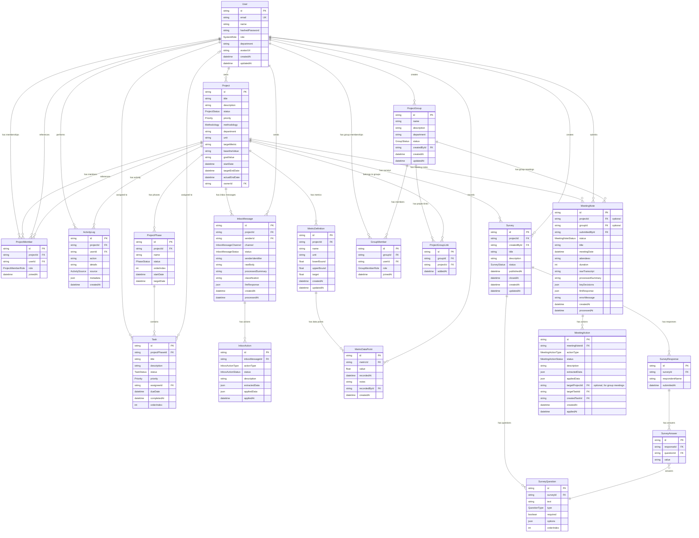

---

## 2. Authentication Flow

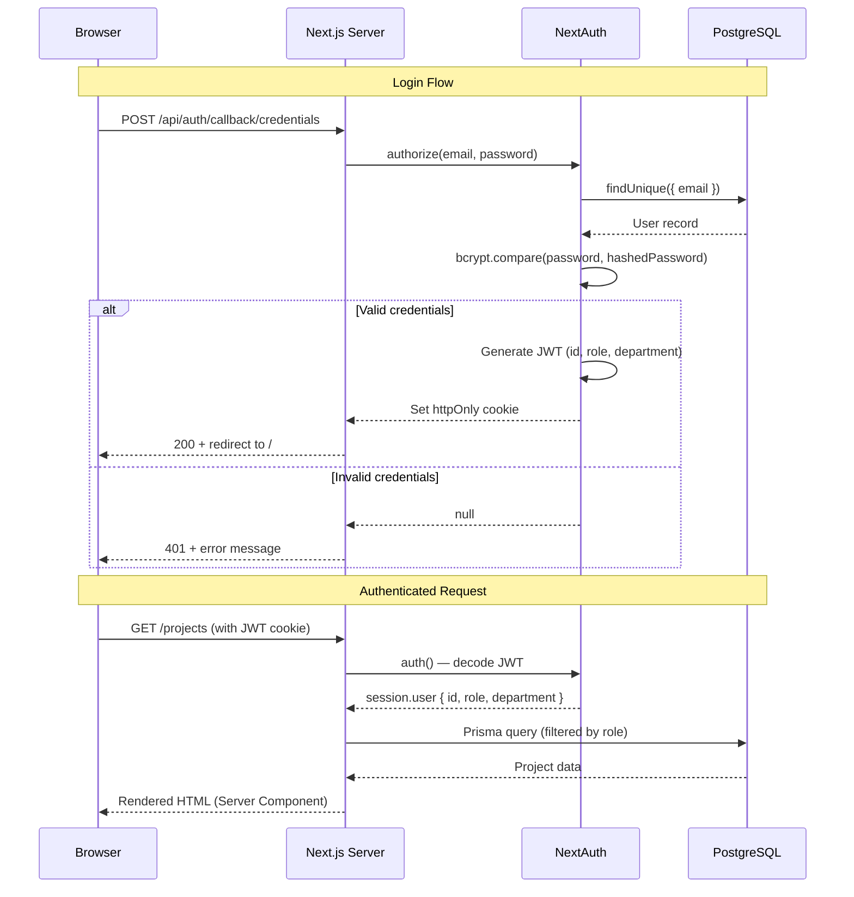

---

## 3. Project Creation Flow

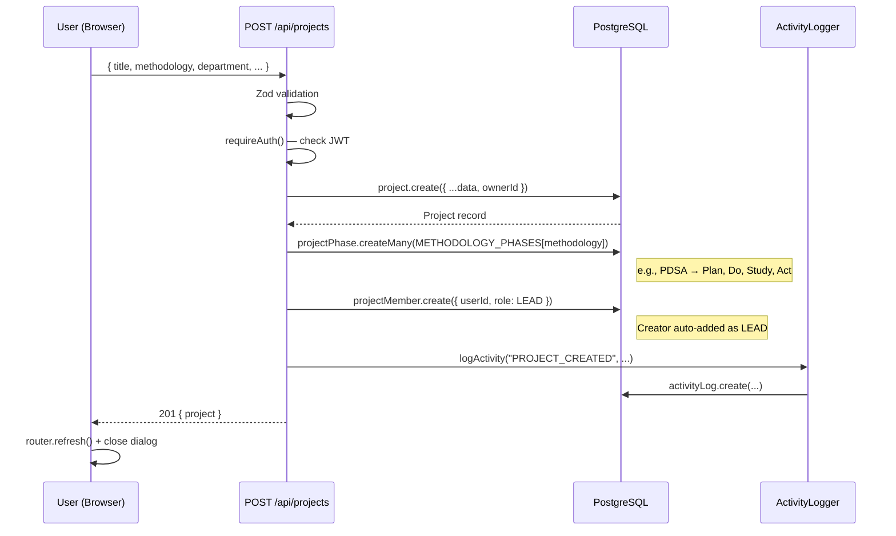

---

## 4. Kanban Drag-and-Drop Flow

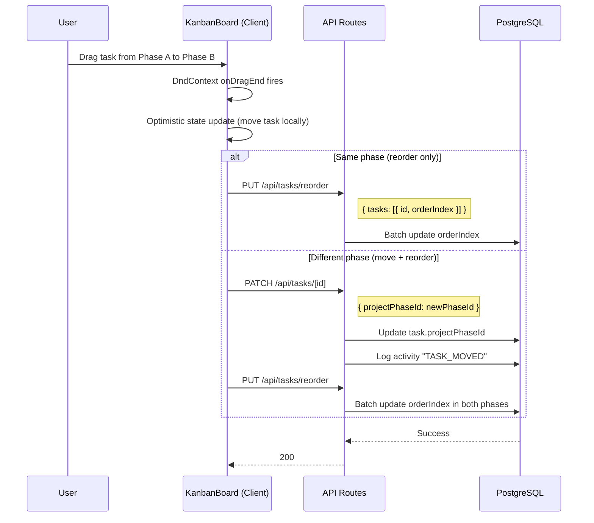

---

## 5. Application Page Structure

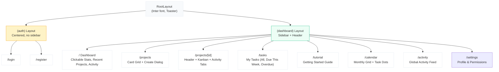

---

## 6. Component Hierarchy

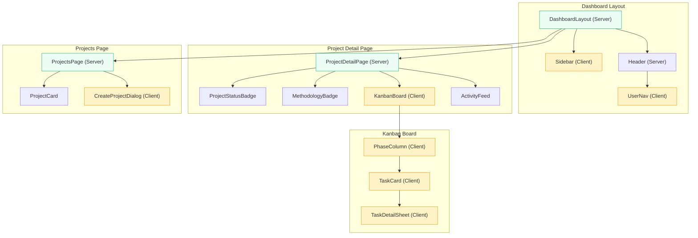

*Legend: Green = Server Component, Yellow = Client Component (`'use client'`)*

---

## 7. Authorization Decision Tree

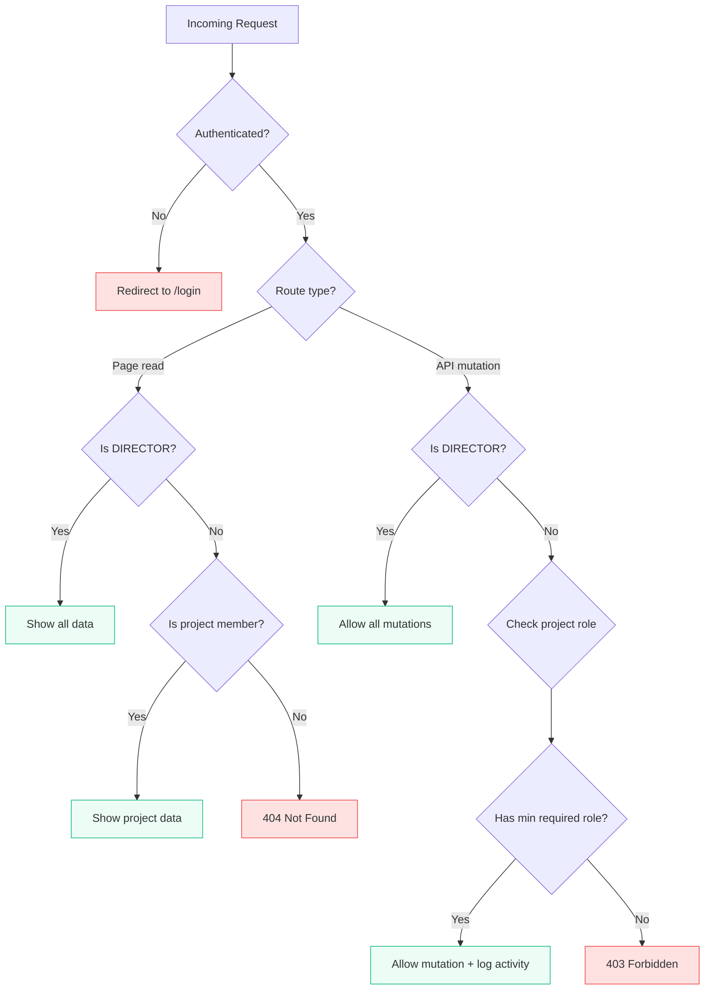

---

## 8. Data Flow: Dashboard Page

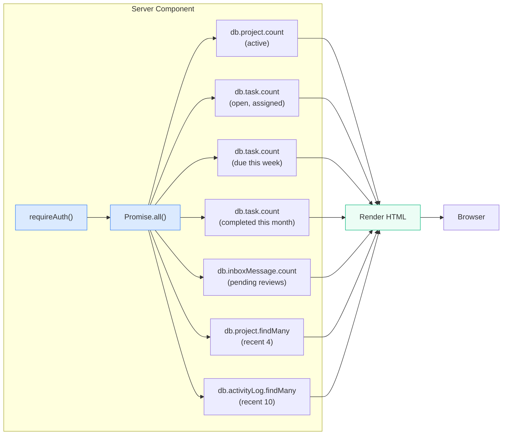

---

## 9. Enum Reference

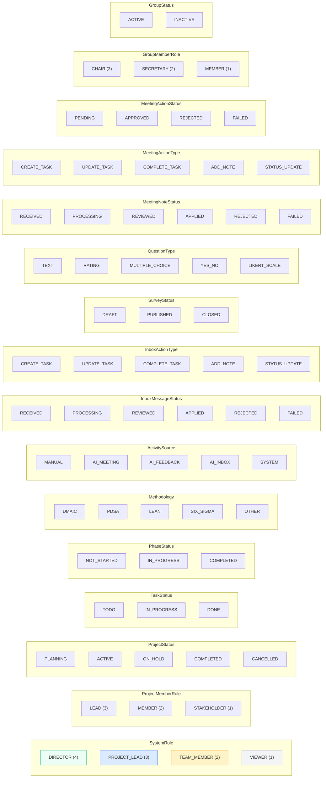

---

## 10. Module Integration Points

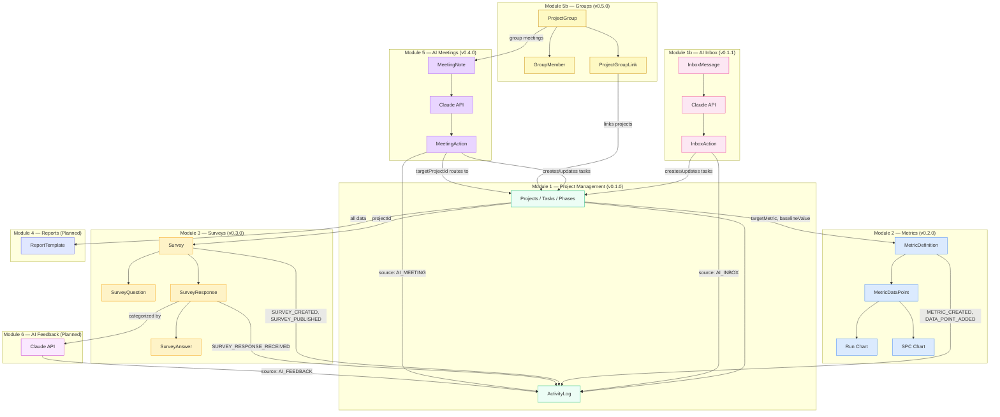

---

## 11. Metrics Data Flow *(v0.2.0)*

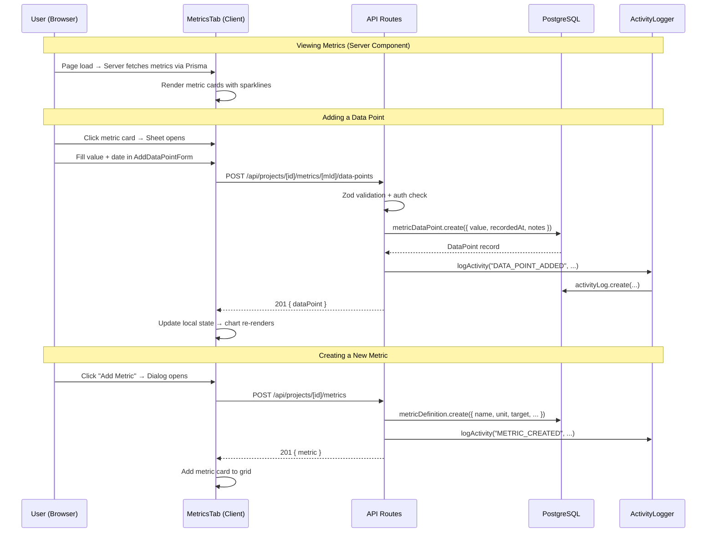

---

## 12. Project Detail Tab Structure *(v0.4.0)*

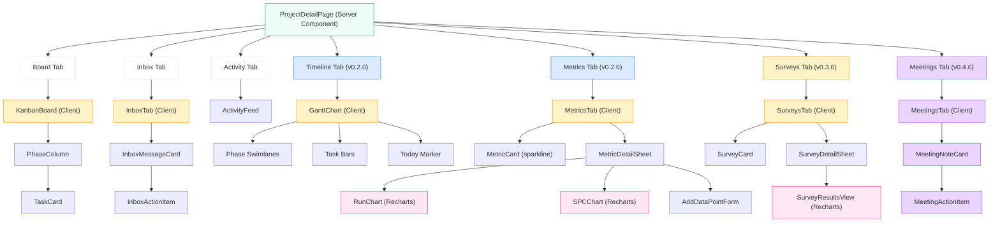

*Legend: Green = Server Component, Yellow = Client Component, Blue = v0.2.0, Orange = v0.3.0, Purple = v0.4.0, Pink = Recharts (dynamic import)*

---

## 13. Gantt Chart Date Calculation *(v0.2.0)*

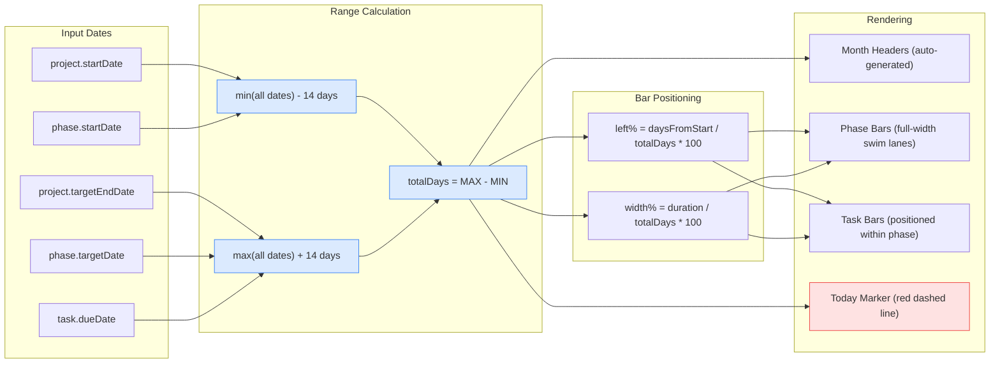

---

## 14. Survey Data Flow *(v0.3.0)*

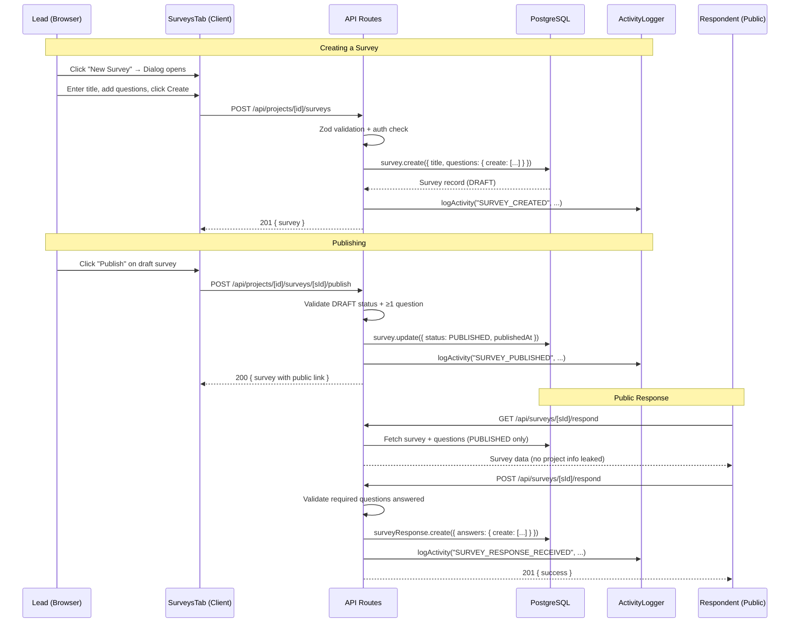

---

## 15. Survey Lifecycle *(v0.3.0)*

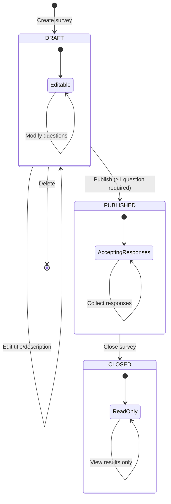

---

## 16. Meeting Notes Data Flow *(v0.4.0)*

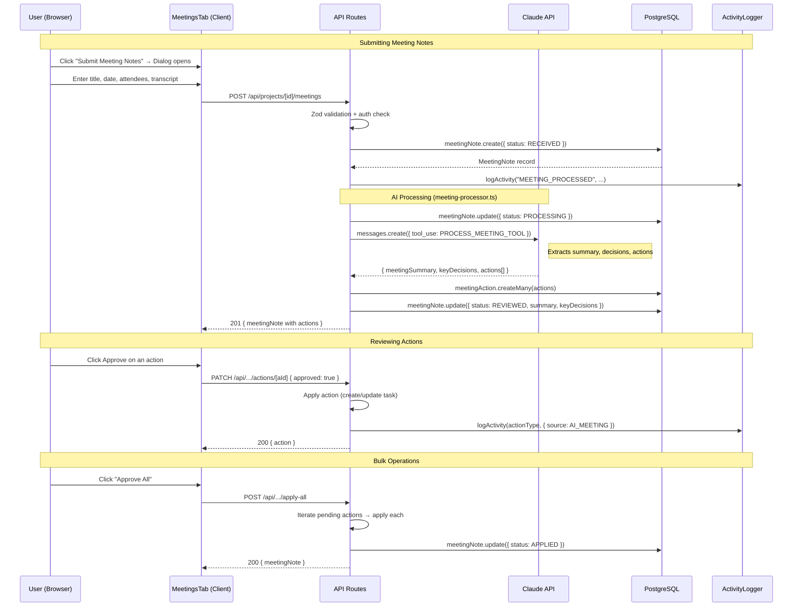

---

## 17. Group Meeting Routing Flow *(v0.5.0)*

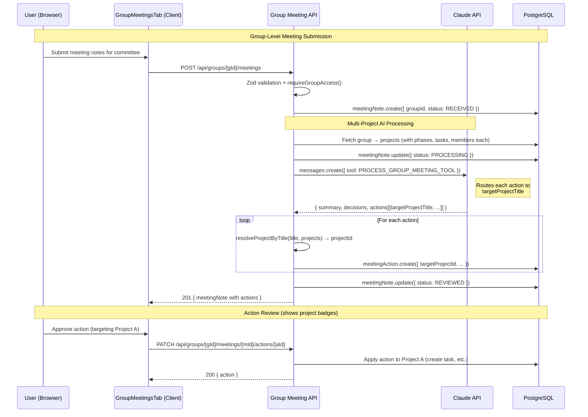
